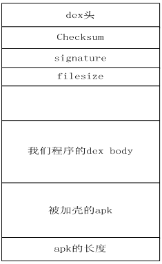

### Apk加固

#### 原理
所谓apk的加壳技术就是在程序的外面再包裹上另外一段代码，保护里面的代码不被非法修改或反编译，在程序运行的时候优先取得程序的控制权做一些我们自己想做的工作。

#### 流程
* 通过反射置换android.app.ActivityThread 中的mClassLoader为加载解密出APK的DexClassLoader，该DexClassLoader一方面加载了源程序、另一方面以原mClassLoader为父节点，这就保证了即加载了源程序又没有放弃原先加载的资源与系统代码。

* 找到源程序的Application，通过反射建立并运行。
这里需要注意的是，我们现在是加载一个完整的Apk,让他运行起来，那么我们知道一个Apk运行的时候都是有一个Application对象的，这个也是一个程序运行之后的全局类。所以我们必须找到解密之后的源Apk的Application类，运行的他的onCreate方法，这样源Apk才开始他的运行生命周期。这里我们如何得到源Apk的Application的类呢？这个我们后面会说道。使用meta标签进行设置。


解密源程序就是从加壳apk中解压出源apk，一般放在asset、classes.dex或者so等文件中，用的最多的就是把源apk放进加壳apk的classes.dex中，包含三部分
* 源apk
* 解壳程序
* 解壳apk

第一步 编译源apk

第二部 编译解壳apk，manifest中需有要使用的源apk中的组建

第三步 合成加壳文件

我们知道android apk最终会打包生成dex文件，我们可以将我们的程序生成dex文件后，将我们要进行加壳的apk和我们dex文件合并成一个文件，然后修改dex文件头中的checksum、signature 和file_size的信息，并且要附加加壳的apk的长度信息在dex文件中，以便我们进行解壳保证原来apk的正常运行。
1) checksum 
文件校验码 ，使用alder32 算法校验文件除去 maigc ，checksum 外余下的所有文件区域 ，用于检查文件错误 。
2) signature 
使用 SHA-1 算法 hash 除去 magic ,checksum 和 signature 外余下的所有文件区域 ，用于唯一识别本文件 。
3) file_size
Dex 文件的大小 。
为什么说我们只需要关注这三个字段呢？
因为我们需要将一个文件(加密之后的源Apk)写入到Dex中，那么我们肯定需要修改文件校验码(checksum).因为他是检查文件是否有错误。那么signature也是一样，也是唯一识别文件的算法。还有就是需要修改dex文件的大小。


加完壳后整个文件的结构如下：


```java
public class ShellTool {
  /**
   * @param args
   */
  public static void main(String[] args) {
         // TODO Auto-generated method stub
         try {
                File payloadSrcFile = new File("payload.apk");//我们要加壳的apk文件
                File unShellDexFile = new File("classes.dex");//我们的程序生成的dex文件
                byte[] payloadArray = encrpt(readFileBytes(payloadSrcFile));
                byte[] unShellDexArray = readFileBytes(unShellDexFile);
                int payloadLen = payloadArray.length;
                int unShellDexLen = unShellDexArray.length;
                int totalLen = payloadLen + unShellDexLen +4;
                byte[] newdex = new byte[totalLen];
                //添加我们程序的dex
                System.arraycopy(unShellDexArray, 0, newdex, 0, unShellDexLen);
                //添加要加壳的apk文件
                System.arraycopy(payloadArray, 0, newdex, unShellDexLen,
                              payloadLen);
                //添加apk文件长度
                System.arraycopy(intToByte(payloadLen), 0, newdex, totalLen-4, 4);
                        //修改DEX file size文件头
                fixFileSizeHeader(newdex);
                //修改DEX SHA1 文件头
                fixSHA1Header(newdex);
                //修改DEX CheckSum文件头
                fixCheckSumHeader(newdex);
 
                String str = "outdir/classes.dex";
                File file = new File(str);
                if (!file.exists()) {
                       file.createNewFile();
                }
                
                FileOutputStream localFileOutputStream = new FileOutputStream(str);
                localFileOutputStream.write(newdex);
                localFileOutputStream.flush();
                localFileOutputStream.close();
 
 
         } catch (Exception e) {
                // TODO Auto-generated catch block
                e.printStackTrace();
         }
  }
```

第四步 这里会生成一个新的classes.dex文件，然后用该文件替换解壳程序中的classes.dex，这个时候用到WinRAR工具，首先找到解壳程序，然后删除借壳程序中的classes.dex，添加第三部产生的classes.dex文件，因为文件已修改，需要重签名

步骤完成了，看下解壳程序中是如何读取源apk并加载的

这里需要注意的一个问题，就是我们需要找到一个时机，就是在脱壳程序还没有运行起来的时候，来加载源程序的Apk，执行他的onCreate方法，那么这个时机不能太晚，不然的话，就是运行脱壳程序，而不是源程序了。查看源码我们知道。Application中有一个方法：attachBaseContext这个方法，他在Application的onCreate方法执行前就会执行了，那么我们的工作就需要在这里进行

得到解壳Apk中的dex文件，然后从这个文件中得到源程序Apk.进行解密，然后加载
```java
//这是context 赋值  
@Override  
protected void attachBaseContext(Context base) {  
    super.attachBaseContext(base);  
    try {  
        //创建两个文件夹payload_odex，payload_lib 私有的，可写的文件目录  
        File odex = this.getDir("payload_odex", MODE_PRIVATE);  
        File libs = this.getDir("payload_lib", MODE_PRIVATE);  
        odexPath = odex.getAbsolutePath();  
        libPath = libs.getAbsolutePath();  
        apkFileName = odex.getAbsolutePath() + "/payload.apk";  
        File dexFile = new File(apkFileName);  
        Log.i("demo", "apk size:"+dexFile.length());  
        if (!dexFile.exists())  
        {  
            dexFile.createNewFile();  //在payload_odex文件夹内，创建payload.apk  
            // 读取程序classes.dex文件  
            byte[] dexdata = this.readDexFileFromApk();  
  
            // 分离出解壳后的apk文件已用于动态加载  
            this.splitPayLoadFromDex(dexdata);  
        }  
        // 配置动态加载环境  
        Object currentActivityThread = RefInvoke.invokeStaticMethod(  
                "android.app.ActivityThread", "currentActivityThread",  
                new Class[] {}, new Object[] {});//获取主线程对象 http://blog.csdn.net/myarrow/article/details/14223493  
        String packageName = this.getPackageName();//当前apk的包名  
        //下面两句不是太理解  
        ArrayMap mPackages = (ArrayMap) RefInvoke.getFieldOjbect(  
                "android.app.ActivityThread", currentActivityThread,  
                "mPackages");  
        WeakReference wr = (WeakReference) mPackages.get(packageName);  
        //创建被加壳apk的DexClassLoader对象  加载apk内的类和本地代码（c/c++代码）  
        DexClassLoader dLoader = new DexClassLoader(apkFileName, odexPath,  
                libPath, (ClassLoader) RefInvoke.getFieldOjbect(  
                        "android.app.LoadedApk", wr.get(), "mClassLoader"));  
        //base.getClassLoader(); 是不是就等同于 (ClassLoader) RefInvoke.getFieldOjbect()? 有空验证下//?  
        //把当前进程的DexClassLoader 设置成了被加壳apk的DexClassLoader  ----有点c++中进程环境的意思~~  
        RefInvoke.setFieldOjbect("android.app.LoadedApk", "mClassLoader",  
                wr.get(), dLoader);  
  
        Log.i("demo","classloader:"+dLoader);  
  
        try{  
            Object actObj = dLoader.loadClass("com.example.forceapkobj.MainActivity");  
            Log.i("demo", "actObj:"+actObj);  
        }catch(Exception e){  
            Log.i("demo", "activity:"+Log.getStackTraceString(e));  
        }  
```

如果需要源程序的application需要运行，找到源程序的Application程序，让其运行，如果不需要，可以直接跳过这里

```java 
@Override  
public void onCreate() {  
    {  
        //loadResources(apkFileName);  
          
        Log.i("demo", "onCreate");  
        // 如果源应用配置有Appliction对象，则替换为源应用Applicaiton，以便不影响源程序逻辑。  
        String appClassName = null;  
        try {  
            ApplicationInfo ai = this.getPackageManager()  
                    .getApplicationInfo(this.getPackageName(),  
                            PackageManager.GET_META_DATA);  
            Bundle bundle = ai.metaData;  
            if (bundle != null && bundle.containsKey("APPLICATION_CLASS_NAME")) {  
                appClassName = bundle.getString("APPLICATION_CLASS_NAME");//className 是配置在xml文件中的。  
            } else {  
                Log.i("demo", "have no application class name");  
                return;  
            }  
        } catch (NameNotFoundException e) {  
            Log.i("demo", "error:"+Log.getStackTraceString(e));  
            e.printStackTrace();  
        }  
        //有值的话调用该Applicaiton  
        Object currentActivityThread = RefInvoke.invokeStaticMethod(  
                "android.app.ActivityThread", "currentActivityThread",  
                new Class[] {}, new Object[] {});  
        Object mBoundApplication = RefInvoke.getFieldOjbect(  
                "android.app.ActivityThread", currentActivityThread,  
                "mBoundApplication");  
        Object loadedApkInfo = RefInvoke.getFieldOjbect(  
                "android.app.ActivityThread$AppBindData",  
                mBoundApplication, "info");  
        //把当前进程的mApplication 设置成了null  
        RefInvoke.setFieldOjbect("android.app.LoadedApk", "mApplication",  
                loadedApkInfo, null);  
        Object oldApplication = RefInvoke.getFieldOjbect(  
                "android.app.ActivityThread", currentActivityThread,  
                "mInitialApplication");  
        //http://www.codeceo.com/article/android-context.html  
        ArrayList<Application> mAllApplications = (ArrayList<Application>) RefInvoke  
                .getFieldOjbect("android.app.ActivityThread",  
                        currentActivityThread, "mAllApplications");  
        mAllApplications.remove(oldApplication);//删除oldApplication  
          
        ApplicationInfo appinfo_In_LoadedApk = (ApplicationInfo) RefInvoke  
                .getFieldOjbect("android.app.LoadedApk", loadedApkInfo,  
                        "mApplicationInfo");  
        ApplicationInfo appinfo_In_AppBindData = (ApplicationInfo) RefInvoke  
                .getFieldOjbect("android.app.ActivityThread$AppBindData",  
                        mBoundApplication, "appInfo");  
        appinfo_In_LoadedApk.className = appClassName;  
        appinfo_In_AppBindData.className = appClassName;  
        Application app = (Application) RefInvoke.invokeMethod(  
                "android.app.LoadedApk", "makeApplication", loadedApkInfo,  
                new Class[] { boolean.class, Instrumentation.class },  
                new Object[] { false, null });//执行 makeApplication（false,null）  
        RefInvoke.setFieldOjbect("android.app.ActivityThread",  
                "mInitialApplication", currentActivityThread, app);  
  
  
        ArrayMap mProviderMap = (ArrayMap) RefInvoke.getFieldOjbect(  
                "android.app.ActivityThread", currentActivityThread,  
                "mProviderMap");  
        Iterator it = mProviderMap.values().iterator();  
        while (it.hasNext()) {  
            Object providerClientRecord = it.next();  
            Object localProvider = RefInvoke.getFieldOjbect(  
                    "android.app.ActivityThread$ProviderClientRecord",  
                    providerClientRecord, "mLocalProvider");  
            RefInvoke.setFieldOjbect("android.content.ContentProvider",  
                    "mContext", localProvider, app);  
        }  
          
        Log.i("demo", "app:"+app);  
          
        app.onCreate();  
    }  
} 
```

对源apk的资源文件，可以用assetmanager去加载，然后由该manager和最初的resource生成新的resource，然后资源的引用都用该resource，但还是会存在资源冲突的问题

在这篇博客上http://www.jianshu.com/p/913330114752 上看到解决方案：
```java
修改aapt源码，定制aapt工具编译期间修改PP段。

DynamicAPK的做法就是如此，定制aapt，替换google的原始aapt，在编译的时候可以传入参数修改PP段：例如传入0x05编译得到的资源的PP段就是0x05。个人觉得这个做法不是太灵活，入侵了原有的开发编译流程，不好维护。

修改aapt的产物，即，编译后期重新整理插件Apk的资源，编排ID。

前面说过apk编译之后会生成ID以及对应的索引表resorce.arsc，那么我们能不能后期修改相关ID及索引表呢？答案是肯定的，个人比较赞同这种思路，不用入侵原有编译流程。
```
基本就是对资源id重新编排，暂时还没有找到其他方法。


### 模块化分层设计
原文：http://baronzhang.com/blog/Framework/Android-%E6%A8%A1%E5%9D%97%E5%8C%96%E6%8E%A2%E7%B4%A2%E4%B8%8E%E5%AE%9E%E8%B7%B5/

模块化是一种处理复杂系统分解为更好的可管理模块的方式。

好处：
* 多团队并行开发测试；
* 模块间解耦、重用；
* 可单独编译打包某一模块，提升开发效率。

示例为原文作者 安居客 Android 端的模块化设计方案

* 组件：指的是单一的功能组件，如地图组件（MapSDK）、支付组件（AnjukePay）、路由组件（Router）等等；

* 模块：指的是独立的业务模块，如新房模块（NewHouseModule）、二手房模块（SecondHouseModule）、即时通讯模块（InstantMessagingModule）等等；模块相对于组件来说粒度更大。


整个项目分为三层，从下至上分别是：
* Basic Component Layer: 基础组件层，顾名思义就是一些基础组件，包含了各种开源库以及和业务无关的各种自研工具库；
* Business Component Layer: 业务组件层，这一层的所有组件都是业务相关的，例如上图中的支付组件 AnjukePay、数据模拟组件 DataSimulator 等等；
* Business Module Layer: 业务 Module 层，在 Android Studio 中每块业务对应一个单独的 Module。例如安居客用户 App 我们就可以拆分成新房 Module、二手房 Module、IM Module 等等，每个单独的 Business Module 都必须准遵守我们自己的 MVP 架构。

!(modules)[modules.png]

对于模块化项目，每个单独的 Business Module 都可以单独编译成 APK。在开发阶段需要单独打包编译，项目发布的时候又需要它作为项目的一个 Module 来整体编译打包。简单的说就是开发时是 Application，发布时是 Library。

同时针对模块化我们也定义了一些自己的游戏规则:

* 对于 Business Module Layer，各业务模块之间不允许存在相互依赖关系，它们之间的跳转通讯采用路由框架 Router 来实现（后面会介绍 Router 框架的实现）;
* 对于 Business Component Layer，单一业务组件只能对应某一项具体的业务，个性化需求对外部提供接口让调用方定制;
* 合理控制各组件和各业务模块的拆分粒度，太小的公有模块不足以构成单独组件或者模块的，我们先放到类似于 CommonBusiness 的组件中，在后期不断的重构迭代中视情况进行进一步的拆分;
上层的公有业务或者功能模块可以逐步下放到下层，合理把握好度就好；
各 Layer 间严禁反向依赖，横向依赖关系由各业务 Leader 和技术小组商讨决定。

模块间跳转通讯（Router）

对业务进行模块化拆分后，为了使各业务模块间解耦，因此各个 Bussiness Module 都是独立的模块，它们之间是没有依赖关系。那么各个模块间的跳转通讯如何实现呢？

比如业务上要求从新房的列表页跳转到二手房的列表页，那么由于是 NewHouseModule 和 SecondHouseModule 之间并不相互依赖，我们通过想如下这种显式跳转的方式来实现 Activity 跳转显然是不可能的实现的。


```java 
Intent intent = new Intent(NewHouseListActivity.this, SecondHouseListActivity.class);
startActivity(intent);
```

有的同学可能会想到用隐式跳转，通过 Intent 匹配规则来实现：

```java
Intent intent = new Intent(Intent.ACTION_VIEW, "<scheme>://<host>:<port>/<path>");
startActivity(intent);
```

但是这种代码写起来比较繁琐，且容易出错，出错也不太容易定位问题。因此一个简单易用、解放开发的路由框架是必须的了。

Router

路由（Router）部分通过 Java 注解结合动态代理来实现，这一点和 Retrofit 的实现原理是一样的。

首先需要定义我们自己的注解（篇幅有限，这里只列出少部分源码）。

用于定义跳转 URI 的注解 FullUri：

```java
@Target(ElementType.METHOD)
@Retention(RetentionPolicy.RUNTIME)
public @interface FullUri {
    String value();
}

@Target(ElementType.PARAMETER)
@Retention(RetentionPolicy.RUNTIME)
public @interface UriParam {
    String value();
}
```

然后实现 Router ,内部通过动态代理的方式来实现 Activity 跳转：

```java
public final class Router {
    ...
    public <T> T create(final Class<T> service) {
        return (T) Proxy.newProxyInstance(service.getClassLoader(), new Class[]{service}, new InvocationHandler() {
            @Override
            public Object invoke(Object proxy, Method method, Object[] args) throws Throwable {
                FullUri fullUri = method.getAnnotation(FullUri.class);
                StringBuilder urlBuilder = new StringBuilder();
                urlBuilder.append(fullUri.value());
                //获取注解参数
                Annotation[][] parameterAnnotations = method.getParameterAnnotations();
                HashMap<String, Object> serializedParams = new HashMap<>();
			    //拼接跳转 URI
                int position = 0;
                for (int i = 0; i < parameterAnnotations.length; i++) {
                    Annotation[] annotations = parameterAnnotations[i];
                    if (annotations == null || annotations.length == 0)
                        break;
                    Annotation annotation = annotations[0];
                    if (annotation instanceof UriParam) {
                        //拼接 URI 后的参数
                        ...
                    } else if (annotation instanceof IntentExtrasParam) {
                        //Intent 传参处理
                        ...
                    }
                }
                //执行Activity跳转操作
                performJump(urlBuilder.toString(), serializedParams);
                return null;
            }
        });
    }
	...
}
```
上面是 Router 实现的部分代码，在使用 Router 来跳转的时候，首先需要定义一个 Interface（类似于 Retrofit 的使用方式）
```java 
public interface RouterService {
    @FullUri("router://com.baronzhang.android.router.FourthActivity")
    void startUserActivity(@UriParam("cityName")
    		String cityName, @IntentExtrasParam("user") User user);
}
```

接下来我们就可以通过如下方式实现 Activity 的跳转传参了：

```java
RouterService routerService = new Router(this).create(RouterService.class);
User user = new User("张三", 17, 165, 88);
routerService.startUserActivity("上海", user);
```

通过 Router 跳转到目标 Activity 后，我们需要在目标 Activity 中获取通过 Intent 传过来的参数：

```java
getIntent().getIntExtra("intParam", 0);
getIntent().getData().getQueryParameter("preActivity");
```


#### 重复依赖

模块化的过程中我们常常会遇到重复依赖的问题，如果是通过 aar 依赖， gradle 会自动帮我们找出新版本，而抛弃老版本的重复依赖。如果是以 project 的方式依赖，则在打包的时候会出现重复类。对于这种情况我们可以在 build.gradle 中将 compile 改为 provided，只在最终的项目中 compile 对应的 library ；

其实从前面的安居客模块化设计图上能看出来，我们的设计方案能一定程度上规避重复依赖的问题。比如我们所有的第三方库的依赖都会放到 OpenSoureLibraries 中，其他需要用到相关类库的项目，只需要依赖 OpenSoureLibraries 就好了。

#### 模块化过程中的建议

对于大型的商业项目，在重构过程中可能会遇到业务耦合严重，难以拆分的问题。我们需要先理清业务，再动手拆分业务模块。比如可以先在原先的项目中根据业务分包，在一定程度上将各业务解耦后拆分到不同的 package 中。比如之前新房和二手房由于同属于 app module，因此他们之前是通过隐式的 intent 跳转的，现在可以先将他们改为通过 Router 来实现跳转。又比如新房和二手房中公用的模块可以先下放到 Business Component Layer 或者 Basic Component Layer 中。在这一系列工作完成后再将各个业务拆分成多个 module 。

模块化重构需要渐进式的展开，不可一触而就，不要想着将整个项目推翻重写。线上成熟稳定的业务代码，是经过了时间和大量用户考验的；全部推翻重写往往费时费力，实际的效果通常也很不理想，各种问题层出不穷得不偿失。对于这种项目的模块化重构，我们需要一点点的改进重构，可以分散到每次的业务迭代中去，逐步淘汰掉陈旧的代码。

各业务模块间肯定会有公用的部分，按照我前面的设计图，公用的部分我们会根据业务相关性下放到业务组件层（Business Component Layer）或者基础组件层（Common Component Layer）。对于太小的公有模块不足以构成单独组件或者模块的，我们先放到类似于 CommonBusiness 的组件中，在后期不断的重构迭代中视情况进行进一步的拆分。过程中完美主义可以有，切记不可过度。

###参考文档
* [http://blog.csdn.net/jiangwei0910410003/article/details/48415225/](http://blog.csdn.net/jiangwei0910410003/article/details/48415225/)
* [https://my.oschina.net/u/2323218/blog/393372](https://my.oschina.net/u/2323218/blog/393372)
* [Android 模块化探索与实践](http://baronzhang.com/blog/Framework/Android-%E6%A8%A1%E5%9D%97%E5%8C%96%E6%8E%A2%E7%B4%A2%E4%B8%8E%E5%AE%9E%E8%B7%B5/)
